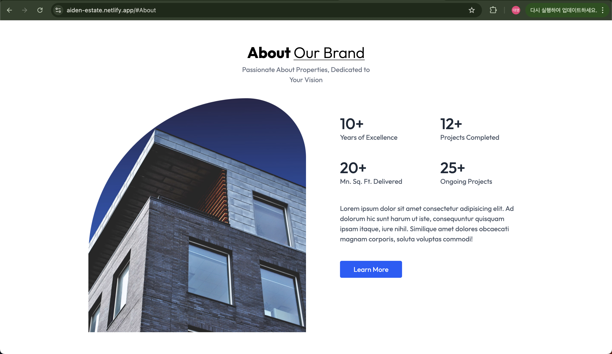
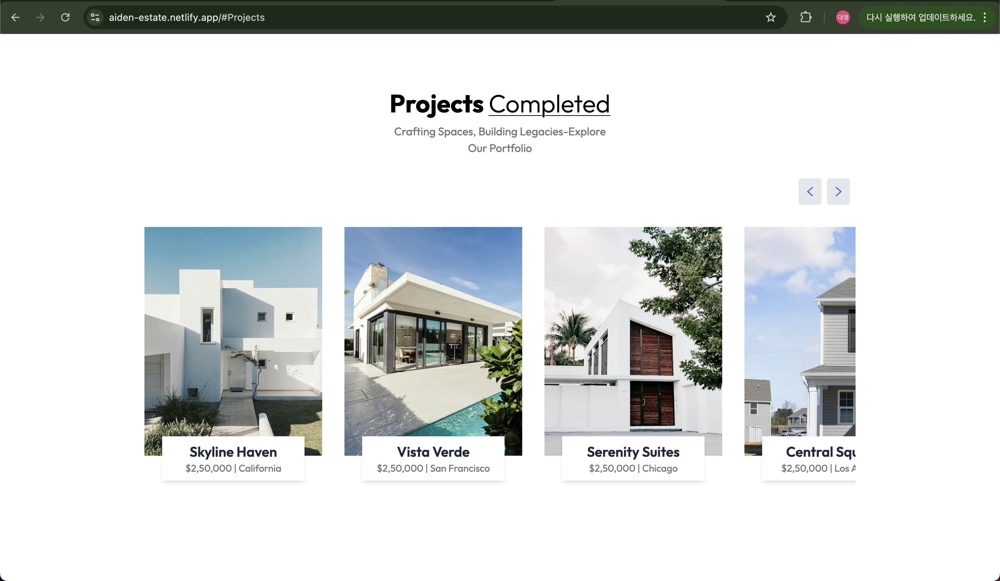
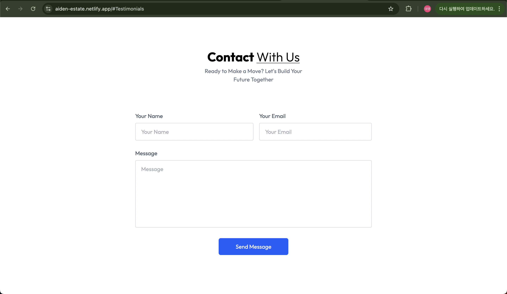
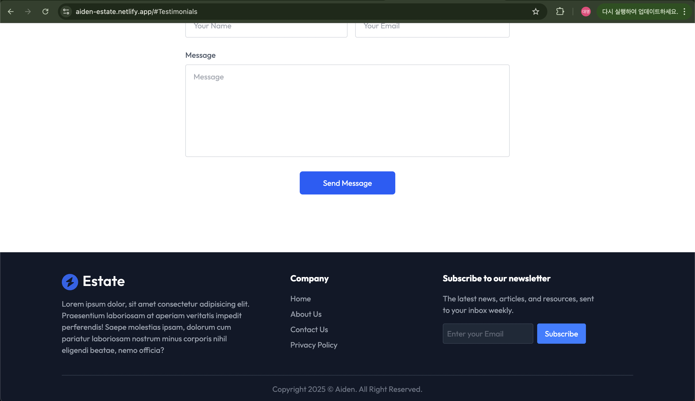

## 📝 프로젝트 소개

이 프로젝트는 React, Vite, TypeScript, Tailwind CSS를 기반으로 제작된 간단한 웹 애플리케이션입니다. 컴포넌트 기반 아키텍처와 스타일링 유틸리티 클래스를 통해 효율적인 UI 구현을 목표로 합니다.

## 🚀 주요 기술 스택

React – UI 구성 라이브러리

Vite – 빠른 개발 환경을 위한 빌드 툴

TypeScript – 정적 타입을 지원하는 JavaScript 확장

Tailwind CSS – 유틸리티 기반 CSS 프레임워크

## 📁 폴더 구조

src/
├── assets/ # 이미지 및 정적 파일
├── components/ # 재사용 가능한 컴포넌트
├── App.tsx # 루트 컴포넌트
├── main.tsx # 엔트리 포인트
├── index.css # Tailwind CSS 설정 포함

## 🖼️ 스크린샷

